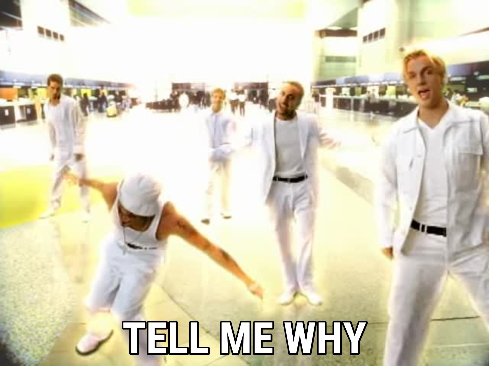

import { CodeSurfer } from 'mdx-deck-code-surfer'
import { code } from 'mdx-deck/themes'
import vsDark from "prism-react-renderer/themes/vsDark"
import Image from './components/Image'

export const theme = {
  ...code,
  codeSurfer: {
    ...vsDark,
    showNumbers: false
  }
}

# Functional Programming
Leco & Xandinho

---

# When?
Lisp, developed in the late 1950s by John McCarthy

---

## 

---

# Closure

---

<CodeSurfer
    code={require("!raw-loader!./closure.js")}
    steps={[
        { notes: "Closure example in JS"},
        { lines: [1] },
        { lines: [2], },
        { lines: [3] },
        { range: [1, 5] },
        { lines: [7], },
        { lines: [8], },
        { range: [10, 11] }
    ]}
/>

---

## 

## "Eu achei esse aqui mais fácil de ler."
### -Thales

---

# Currying

---

<CodeSurfer
    code={require("!raw-loader!./currying.js")}
    steps={[
        { notes: "Currying example in JS"},
        { lines: [1] },
        { lines: [2] },
        { lines: [3] },
        { lines: [4] },
        { range: [1, 7] },
        { lines: [9] }
    ]}
/>

---

# The end